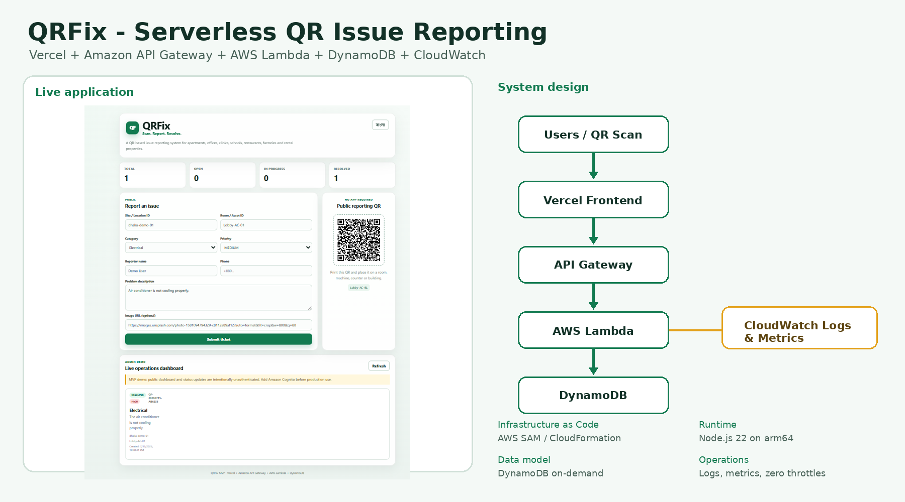
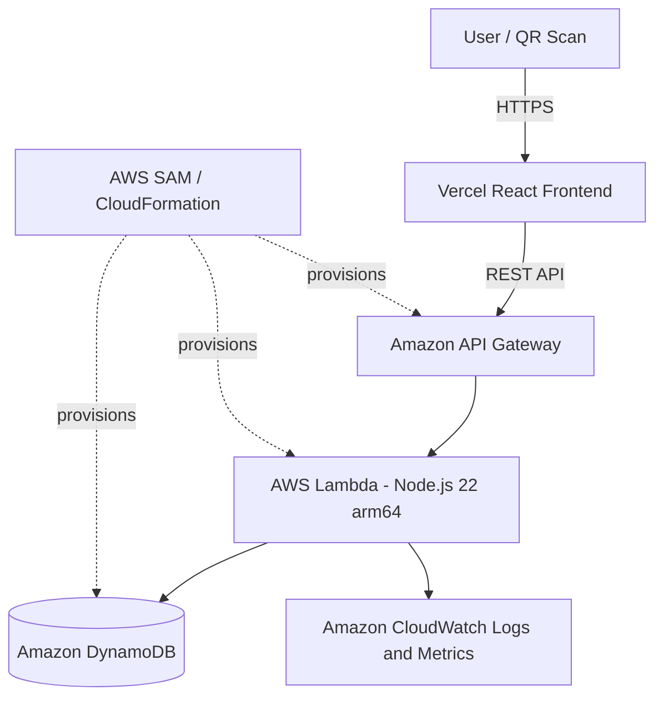
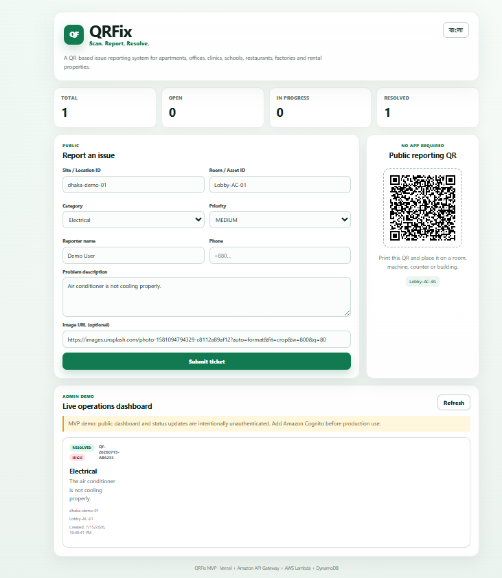
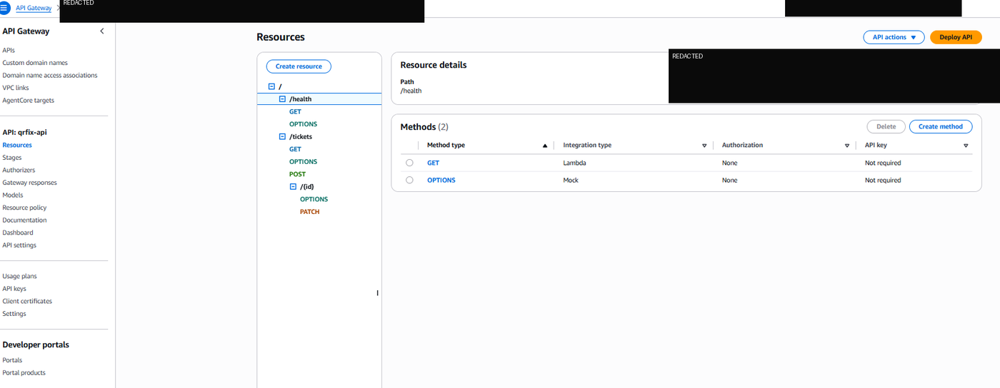
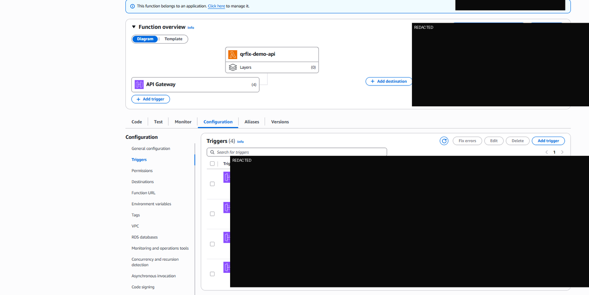
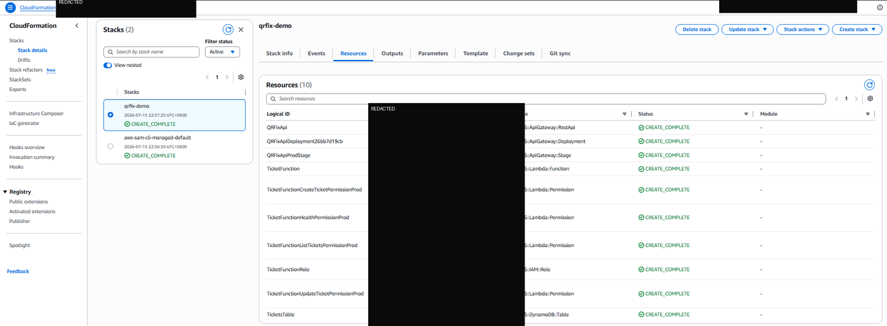
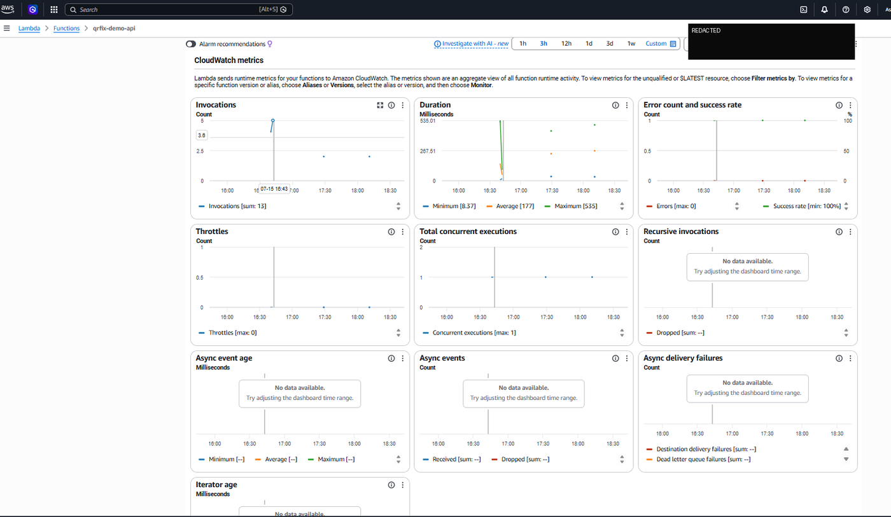
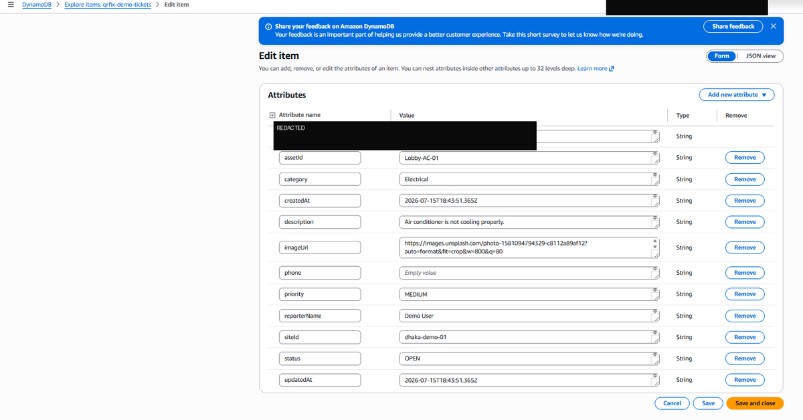
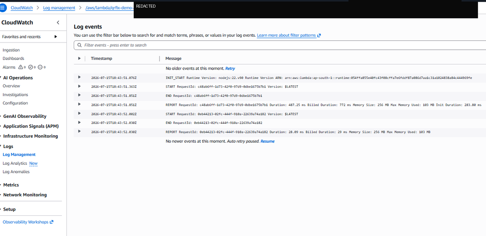

# QRFix - Serverless QR-Based Issue Reporting

[](https://qrfix-omega.vercel.app)


**QRFix** is a bilingual QR-based maintenance and issue-reporting MVP for apartments, offices, clinics, schools, restaurants, factories, warehouses, rental properties, and other managed facilities.

A user scans a QR code attached to a room or asset, submits an issue, and the operations team manages the ticket through a live dashboard.

- **Live demo:** https://qrfix-omega.vercel.app
- **Cloud region:** Asia Pacific (Mumbai), `ap-south-1`
- **Architecture:** Vercel + API Gateway + Lambda + DynamoDB + CloudWatch
- **Infrastructure as Code:** AWS SAM and CloudFormation



## Problem and solution

Maintenance complaints are often reported through phone calls, chat messages, or verbal communication. Those reports are difficult to track, prioritize, and audit.

QRFix converts each report into a structured ticket:

1. Place a QR code on a room, floor, machine, counter, or building.
2. A user scans the code without installing an application.
3. The user submits a categorized issue with priority and optional image URL.
4. The backend stores the ticket in DynamoDB.
5. Operations staff move the ticket through `OPEN`, `IN_PROGRESS`, and `RESOLVED`.
6. CloudWatch captures runtime logs and operational metrics.

## Main features

- English and Bangla interface
- Dynamic QR code generated from site and asset IDs
- Public issue submission form
- Priority levels: `LOW`, `MEDIUM`, `HIGH`
- Ticket workflow: `OPEN` -> `IN_PROGRESS` -> `RESOLVED`
- Live statistics and operations dashboard
- Serverless REST API
- On-demand DynamoDB billing
- CloudWatch logs and Lambda metrics
- AWS SAM/CloudFormation deployment
- Vercel-hosted React frontend
- No always-on server or personal computer required

## System design



### Request flow

```text
QR Scan / Browser
        |
        v
Vercel React Frontend
        |
        v
Amazon API Gateway
        |
        v
AWS Lambda
        |
        +----> Amazon DynamoDB
        |
        +----> CloudWatch Logs and Metrics
```

## AWS resources

The SAM template provisions:

| Resource | Purpose |
|---|---|
| API Gateway REST API | Public HTTP API and `Prod` stage |
| Lambda function | Ticket creation, listing, health check, and status update |
| DynamoDB table | Stores ticket records using `ticketId` as the partition key |
| IAM execution role | Grants the Lambda function scoped DynamoDB and logging permissions |
| Lambda permissions | Allows API Gateway to invoke the required routes |
| CloudWatch Logs | Captures Lambda runtime output and execution reports |

## API routes

| Method | Route | Description |
|---|---|---|
| `GET` | `/health` | API health check |
| `GET` | `/tickets?siteId=<site>` | List tickets, optionally filtered by site |
| `POST` | `/tickets` | Create a ticket |
| `PATCH` | `/tickets/{id}` | Update ticket status |

Example ticket creation request:

```bash
curl -X POST "$API_URL/tickets" \
  -H "Content-Type: application/json" \
  -d '{
    "siteId": "dhaka-demo-01",
    "assetId": "Lobby-AC-01",
    "category": "Electrical",
    "description": "The air conditioner is not cooling properly.",
    "reporterName": "Demo User",
    "priority": "HIGH"
  }'
```

## Repository structure

```text
qrfix-serverless/
├── backend/
│   ├── src/
│   │   ├── app.mjs
│   │   └── package.json
│   └── template.yaml
├── frontend/
│   ├── src/
│   │   ├── App.jsx
│   │   ├── main.jsx
│   │   └── styles.css
│   ├── .env.example
│   ├── index.html
│   ├── package.json
│   └── vercel.json
├── images/
│   ├── readme/
│   └── all-provided/
├── .github/workflows/validate.yml
├── QUICKSTART.md
└── README.md
```

## Local frontend development

Prerequisite: Node.js LTS.

```powershell
cd frontend
Copy-Item .env.example .env
```

Set your deployed API URL in `.env`:

```env
VITE_API_URL=https://YOUR_API_ID.execute-api.ap-south-1.amazonaws.com/Prod
```

Install and start:

```powershell
npm.cmd install
npm.cmd run dev
```

Open the URL displayed by Vite.

## Deploy the backend with AWS SAM

Run from AWS CloudShell or a workstation with AWS CLI and SAM CLI configured:

```bash
cd backend
sam build
sam deploy \
  --stack-name qrfix-demo \
  --region ap-south-1 \
  --resolve-s3 \
  --capabilities CAPABILITY_IAM \
  --no-confirm-changeset
```

Get the API URL without hard-coding it:

```bash
aws cloudformation describe-stacks \
  --stack-name qrfix-demo \
  --region ap-south-1 \
  --query "Stacks[0].Outputs[?OutputKey=='ApiUrl'].OutputValue" \
  --output text
```

Test the health endpoint:

```bash
API_URL="$(aws cloudformation describe-stacks \
  --stack-name qrfix-demo \
  --region ap-south-1 \
  --query "Stacks[0].Outputs[?OutputKey=='ApiUrl'].OutputValue" \
  --output text)"

curl "$API_URL/health"
```

## Deploy the frontend to Vercel

From the `frontend` directory:

```powershell
npm.cmd install -g vercel
vercel.cmd login
vercel.cmd link
vercel.cmd env add VITE_API_URL production
vercel.cmd env add VITE_API_URL preview
vercel.cmd --prod
```

The API URL is a public frontend configuration value, not an AWS credential. Never place AWS access keys, secret keys, database passwords, or private tokens in a `VITE_` variable.

## Evidence and screenshots

### Live application



### API Gateway routes



### Lambda and API Gateway integration



### Infrastructure provisioned through CloudFormation



### CloudWatch metrics

The demo generated Lambda invocations with a successful execution rate and no throttling during the recorded test window.



### DynamoDB ticket record



### CloudWatch execution logs



The `images/all-provided` directory contains the complete redacted implementation screenshot set. Only the most useful screenshots are embedded in this README.

## Cost-conscious design

QRFix intentionally avoids EKS, EC2, RDS, NAT Gateway, and an Application Load Balancer for the MVP.

The architecture uses managed serverless services and on-demand capacity, making it suitable for a low-traffic portfolio demo. Actual cost depends on account eligibility, traffic, log retention, and data transfer.

Recommended budget controls:

- Create a monthly AWS budget.
- Add alerts at 50%, 80%, and 100%.
- Keep DynamoDB in on-demand mode for unpredictable demo traffic.
- Use short CloudWatch log retention for a temporary demo.
- Delete the stack when the demo is no longer required.

## Security status

This repository is a portfolio MVP, not a production-ready multi-tenant SaaS.

Current demo limitations:

- Public unauthenticated API
- Public dashboard and status changes
- Broad CORS configuration for demo access
- No tenant isolation
- External image URL instead of controlled uploads
- DynamoDB `Scan` used for the small MVP dataset

Before production use, add:

- Amazon Cognito authentication
- Tenant and role-based authorization
- API Gateway throttling and AWS WAF
- Strict origin-specific CORS
- S3 presigned uploads and malware scanning
- DynamoDB GSIs for site/status queries
- CloudWatch alarms and structured application logs
- Data retention, backup, and privacy controls
- Custom domain and TLS configuration

## Cleanup

To avoid continued AWS usage:

```bash
sam delete \
  --stack-name qrfix-demo \
  --region ap-south-1 \
  --no-prompts
```

Deleting the backend stack makes the live frontend unable to create or load tickets.

## CV-ready project summary

> Built and deployed QRFix, a bilingual QR-based maintenance-ticketing MVP using React, Vercel, Amazon API Gateway, AWS Lambda, DynamoDB, IAM, CloudWatch, AWS SAM, and CloudFormation. Designed a low-cost serverless architecture, implemented REST APIs and ticket status workflows, and validated the deployment with logs and operational metrics.

## Roadmap

- Cognito login and admin roles
- Multi-tenant organizations and subscriptions
- S3 image uploads
- Email and WhatsApp notifications
- Ticket assignment and SLA tracking
- CSV/PDF reports
- Custom QR label generator
- Audit history and analytics

## License

This project is provided for portfolio and learning purposes. Review and adapt security, privacy, and commercial requirements before using it for a real customer.
